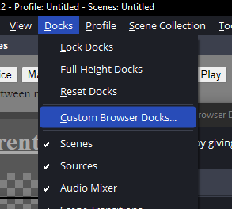
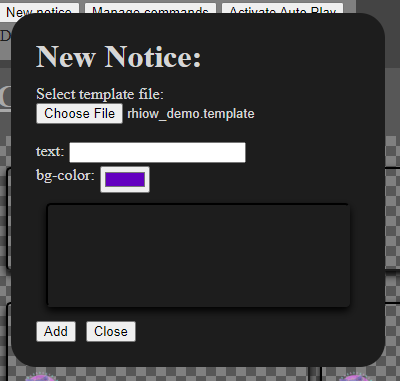
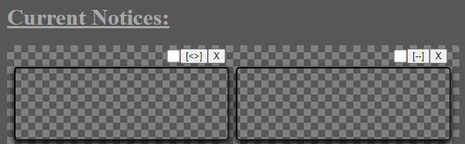
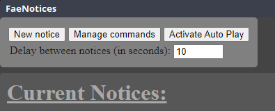

# Fae Notices

Fae Notice is a Custom Dock and Browser Source for [OBS](https://obsproject.com/) to allow for displaying user (streamer) made notices on streams. It includes the options to create notices from premade templates and manage notices on the dock as well as manually display them or select them for displaying them as a carousel sorth of automated display. 

## Using Fae Notices

### Installing into OBS

1) Download the latest release package from the release section or [here](https://github.com/Speedy321/FaeNotices/releases/latest).
2) Unzip the content to a good place on your computer.
3) In OBS Studio, go => Docks => Custom Browser Docks.

4) Add a new Dock by entering a name and the path from the `dashboard.html` file that is in the folder you unzipped Fae Notices to in the following format: `file://<absolute path to>\dashboard.html`.

> Ex: Fae Notices has been unzipped into (on windows):
`C:\stream_stuff\Fae Notices\`
Then the path to put into the custom dock will be:
`file://C:\stream-stuff\Fae Notices\dashboard.html`

5) Click Apply.
6) Place your new Dock wherever you want on OBS.
7) Add a new Browser Source to your scene.
8) The URL field is going to be the same path as the Dock, but to the `notice_bubble.html`, so following: `file://<absolute path to>\notice_bubble.html`. 
**The option `local file` should NOT be selected**

> Ex: Assuming the same path as the previous exemple, the browser source path would be:
`file://C:\stream_stuff\Fae Notices\notice_bubble.html`

9) The width and height parameters should be greater than the size of the templates you're planning to use. 600x400 px should work for most situations.
10) Select `Control Audio via OBS`.
11) Delete the content of the `Custom CSS` box.
12) Position and resize your new browser source on your scene.

### Making notices

1) On the custom dock, click "New notice".
2) On the new notice pannel, use the file picker to pick a notice template file. The pannel will autopulate with customisation options for that template.
> *Notice templates NEED to be in the `templates` folder in your Fae Notices unzip/install folder*
3) Customize your notice as needed, using the preview to see what it will look like.

4) Click `Add`, the notice should appear in the list underneat.
5) You can add multiple notices this way, once you're done, click `close`.

### Deleting notices

Each notice created, and displayed in the `Current Notices` list has a `X` button associated with it. Clicking this button will delete the notice from the list. 
*There is no confirmation to deletion. A deleted notice cannot be reverted but one can always remake the notice from the template.*

### Displaying notices manually

Assuming the autmated carousel isn't active (see next section), and assuming you have created notices, you can click the `[--]` button to display it on your browser source. *If the notice is animated, it will loop through it's animation automaticaly*
When a notice is being displayed, the `[--]` button will change to `[<>]`. Clicking on it again will hide the notice.

### Using the automated carousel

Each notice in the notice list has a check box next to the `[--]`/`[<>]` and `X` buttons. Every notice where this check box is *checked* is considered part of the carousel. To activate the carousel, use the `Activate Auto Play` button on the top bar of the Dock. This button will change into `Deactivate Auto Play` and can be clicked again to stop the carousel. Under this button is a setting to set the amount of time, in seconds, each notice will be displayed for when the carousel is actif.

## Creating your own notice templates

A notice template is a small html web page, with associated css and javascript as required, and a `*.template` json formated file that informs the system on the template's configurable options.

For more information on creating your own templates see [Creating Templates](/docs/creating_templates.md).

## Modifying, improving or fixing Fae Notices

Feel free to fork this project, modify it for your needs or fix bugs and create pull requests. Support for this by me/the creator will be limited though, if you decide to modify this project I'm going to assume you know what you're doing.

*This doesn't include creating notice templates, that is fully supported by me and shouldn't require forking or editing Fae Notices itself, see the section before.*